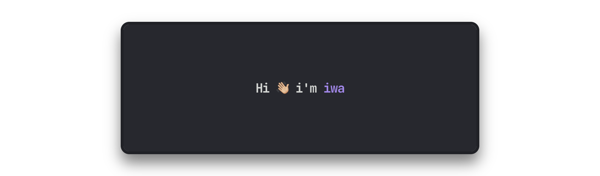

software engineer 
typescript, swift, go, rust (learning), java, c#, php, html/css/js

building projects, self-hosting, always learning 

###### 🌱 notable projects

- **[Kwako](https://github.com/iwa/Kwako):** modular, general-purpose discord bot
- **[Q-Bot](https://github.com/iwa/Q-Bot):** discord bot for the artist Qumu
- **[nomic](https://github.com/iwa/nomic):** discord bot for accessibility in voice chat
- **[idcbyt](https://github.com/iwa/idcbyt):** protest bot for playing youtube audio in discord
- **GymBot:** twitch chatbot for [gymnast86](https://www.twitch.tv/gymnast86)
- **[wiki](https://github.com/iwa/wiki):** personal notes, guides, and homelab documentation

> [website](https://iwa.sh) | [wiki](https://wiki.iwa.sh/#homelab)